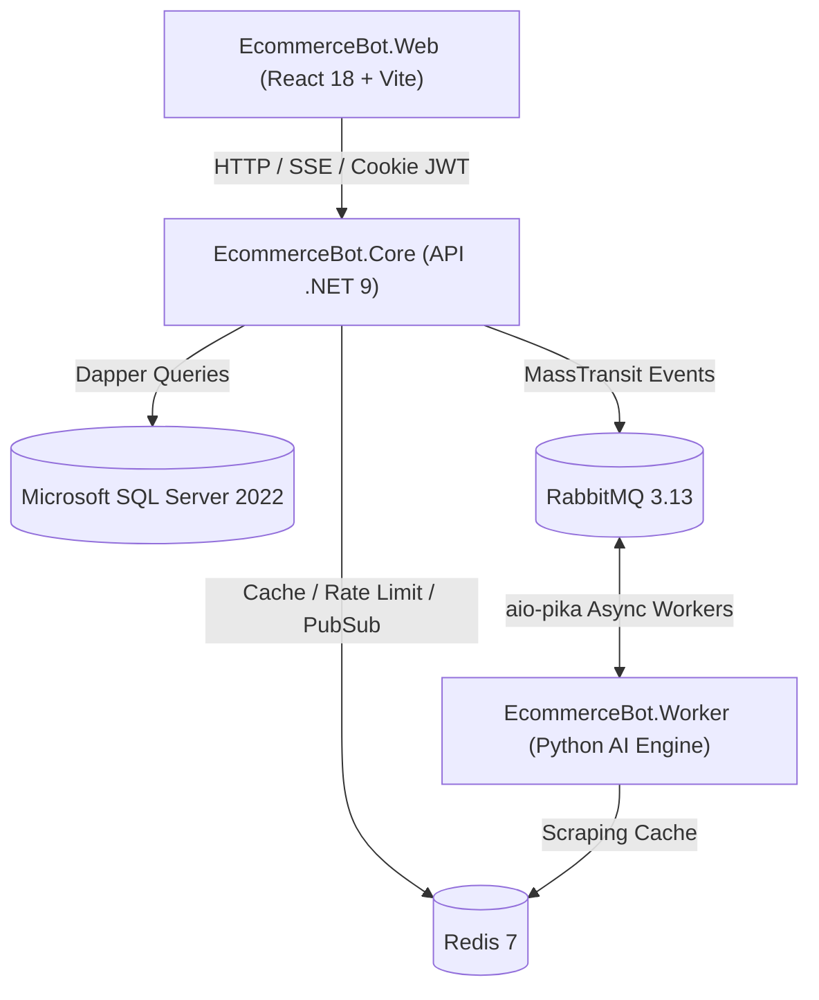

# E-commerce Bot 🛒🤖

Plataforma SaaS escalável para extração inteligente de produtos, enriquecimento de catálogo via Modelos de Linguagem (DeepSeek / Llama 3.3 / Gemini via OpenRouter), precificação e previsão de vendas com Machine Learning, além de integrações nativas com **Shopify**, **Nuvemshop** e **Mercado Pago**.

---

## 📚 Documentação Técnica de Engenharia (`/docs`)

Para guias aprofundados, diagramas conceituais, contratos de API e procedimentos operacionais, consulte a pasta [`/docs`](docs/):

| Manual | Descrição |
|---|---|
| 🏛️ [**Arquitetura do Sistema**](docs/architecture.md) | Visão geral dos 4 pilares, Clean Architecture DDD no .NET 9, persistência Dapper e modelo SQL Server 2022. |
| 🐇 [**Mensageria, Pipelines de IA & Workers**](docs/messaging-and-workers.md) | Topologia RabbitMQ, contratos JSON, pipeline anti-bloqueio Scrapling (Tier 1 & Tier 2) e modelos de ML. |
| 🔒 [**Segurança, Multi-Tenancy & BYOK**](docs/security-and-multitenancy.md) | Isolamento de tenants (`X-Tenant-ID`), criptografia AES-256 GCM para chaves de API e proteção Anti-SSRF. |
| 🔌 [**Webhooks, Integrações & Notificações**](docs/webhooks-and-integrations.md) | Validação HMAC de Webhooks (MP, Shopify, Nuvemshop, Resend), e-mails Razor (`.cshtml`) e alertas Discord. |
| 🚀 [**Guia de Deploy, Infra & Operações**](docs/deployment-and-operations.md) | Orquestração Docker Compose, rotinas de backup comprimido no Cloudflare R2 e testes de Disaster Recovery. |

---

## 📁 Estrutura do Repositório (Monorepo)

O projeto é dividido em 4 pilares principais:

* ⚡ **`EcommerceBot.Core/`**: API Central em **.NET 9 (C#)** seguindo Clean Architecture / DDD, responsável por autenticação JWT, isolamento multi-tenant estrito, persistência com Dapper, pagamentos e orquestração MassTransit.
* 🐍 **`EcommerceBot.Worker/`**: Microsserviço **Python 3.13** assíncrono (FastAPI + aio-pika) focado estritamente em inferência LLM, Web Scraping inteligente anti-bot (Scrapling + Camoufox) e Machine Learning preditivo (Scikit-Learn). **Sem acesso direto ao banco de dados.**
* 🔷 **`Database.Migrations/`**: Runner de migrações determinísticas em **.NET 8** com DbUp para **Microsoft SQL Server 2022**.
* 🔵 **`EcommerceBot.Web/`**: Portal Web Frontend SPA em **React 18**, TypeScript, Vite e Tailwind CSS.
* 🛠️ **`infra/`**: Configurações de infraestrutura isoladas para **Desenvolvimento** (`infra/dev`) e **Produção VPS** (`infra/prod`).

---

## 🏗️ Visão Geral da Arquitetura



---

## 🚀 Como Rodar o Projeto Localmente

Consulte o passo a passo completo no [Guia de Deploy e Operações](docs/deployment-and-operations.md).

### 1. Subir a Infraestrutura (SQL Server 2022, Redis, RabbitMQ):
```bash
cd infra/dev
docker compose -f docker-compose.dev.yml up -d
```

### 2. Rodar as Migrações do Banco de Dados:
```bash
dotnet run --project Database.Migrations/Database.Migrations.csproj
```

### 3. Iniciar a API Core (.NET 9):
```bash
dotnet run --project EcommerceBot.Core/src/EcommerceBot.Api/EcommerceBot.Api.csproj
```

### 4. Iniciar o AI/ML Worker (Python 3.13):
```bash
cd EcommerceBot.Worker
uvicorn app.main:app --host 0.0.0.0 --port 8000 --reload
```

### 5. Iniciar o Frontend Web (React 18):
```bash
cd EcommerceBot.Web
npm install
npm run dev
```

---

## 🛡️ Segurança & Conformidade

- **Autenticação:** JWT com Cookies `HttpOnly` e rotação de Refresh Tokens.
- **Isolamento Multi-Tenant:** `X-Tenant-ID` validado contra claims JWT em todas as requisições autenticadas.
- **Criptografia BYOK:** Chaves de IA de clientes cifradas com AES-256 GCM.
- **Webhooks Seguros:** Assinaturas validadas com tempo constante (`FixedTimeEquals`) e idempotência de 24 horas via Redis `SET NX`.
- **Análise Estática:** 100% aprovado no scanner de segurança Semgrep.
