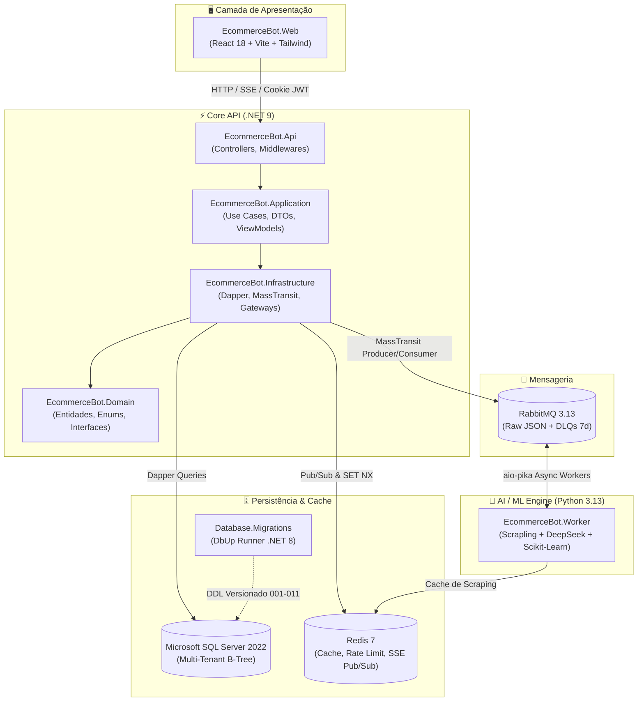

# 🏛️ Arquitetura do Sistema — E-commerce Bot

Este documento descreve a visão geral da arquitetura, os quatro pilares do ecossistema, os fluxos de dados ponta a ponta e as convenções de design adotadas no **E-commerce Bot**.

---

## 📐 1. Visão Geral dos 4 Pilares

O **E-commerce Bot** é uma plataforma SaaS escalável e orientada a eventos (*Event-Driven Architecture - EDA*), organizada em um monorepo com quatro componentes principais:



### Resumo dos Componentes

| Componente | Tecnologia | Responsabilidade Principal |
|---|---|---|
| **`EcommerceBot.Web`** | React 18, TypeScript, Vite, Tailwind CSS | SPA responsiva (Mobile-First, A11y), autenticação JWT via Cookie `HttpOnly`, SSE em tempo real. |
| **`EcommerceBot.Core`** | .NET 9, C#, ASP.NET Core Web API | Clean Architecture / DDD, autenticação, multi-tenancy estrito, Dapper ORM, Gateways (Mercado Pago, Resend, Shopify, Nuvemshop), orquestração MassTransit. |
| **`EcommerceBot.Worker`** | Python 3.13, FastAPI, aio-pika, Scrapling, Scikit-Learn | Inferência LLM (OpenRouter / DeepSeek / Groq), Web Scraping inteligente anti-bot e modelos preditivos de Machine Learning (RFM, Churn, LTV). **Zero acesso direto ao banco de dados.** |
| **`Database.Migrations`** | .NET 8, C#, DbUp | Execução determinística e idempotente de migrações T-SQL no Microsoft SQL Server 2022. |

---

## ⚡ 2. Clean Architecture no Core (.NET 9)

O backend central adota os princípios de Clean Architecture e Domain-Driven Design (DDD):

```
EcommerceBot.Core/
├── src/
│   ├── EcommerceBot.Domain/         # Camada Central (Zero dependências externas)
│   │   ├── Entities/                # Tenant, User, Product, Order, Plan, EmailLog, RobotActivity
│   │   ├── Enums/                   # EmailStatus, ProductStatus, SubscriptionStatus
│   │   └── Interfaces/              # IUserRepository, IProductRepository, IEmailRepository, etc.
│   │
│   ├── EcommerceBot.Application/    # Casos de Uso & Contratos
│   │   ├── DTOs/                    # Contratos de entrada/saída (Auth, Products, Checkout, Scraper)
│   │   ├── ViewModels/              # ViewModels para templates de email (Welcome, PaymentApproved)
│   │   ├── Interfaces/              # IAuthService, IScraperService, IDiscordAlertService, IRazorTemplateRenderer
│   │   └── Security/                # UrlSecurityValidator (Prevenção de SSRF)
│   │
│   ├── EcommerceBot.Infrastructure/ # Implementações Técnicas & Gateways
│   │   ├── Data/                    # DbConnectionFactory (SqlConnection)
│   │   ├── Repositories/            # Implementações Dapper de I*Repository
│   │   ├── Services/                # AuthService, AesGcmCryptoService, RazorViewToStringRenderer, DiscordAlertService
│   │   ├── Gateways/                # ShopifyGateway, NuvemshopGateway, MercadoPagoGateway, ResendGateway
│   │   ├── Messaging/               # MassTransit Consumers (EmailNotificationConsumer, ProcessedProductConsumer, etc.)
│   │   └── Options/                 # Classes tipadas de configuração (IOptions<T>)
│   │
│   └── EcommerceBot.Api/            # Ponto de Entrada HTTP
│       ├── Controllers/             # BaseApiController, AuthController, ProductsController, etc.
│       ├── Middlewares/             # TenantHeaderMiddleware, Global Exception Handler
│       ├── Views/Emails/            # Templates Razor (.cshtml) para e-mails transacionais
│       └── Program.cs               # Composição DI, rotas, segurança e inicialização
```

---

## 🗄️ 3. Persistência de Dados & SQL Server 2022

### Regras Canônicas de Modelagem T-SQL:
1. **Identificadores (IDs):** `UNIQUEIDENTIFIER NOT NULL DEFAULT NEWSEQUENTIALID()` para eliminar a fragmentação de índices clustered B-Tree.
2. **Isolamento Multi-Tenant:** Toda tabela com dados de clientes contém `TenantId UNIQUEIDENTIFIER NOT NULL` com chave estrangeira `FK_Table_Tenants` com `ON DELETE CASCADE`.
3. **Precisão Temporal:** Colunas temporais utilizam `DATETIMEOFFSET NOT NULL DEFAULT SYSDATETIMEOFFSET()` para manter carimbos UTC com precisão de nanossegundos.
4. **Modelo Dual de Saldos no SaaS (`dbo.Tenants`):**
   - `CreditsBalance INT`: Cota de produtos a enriquecer (ex: 500 produtos/mês).
   - `ManagedCreditBalance DECIMAL(18,6)`: Saldo em reais para consumo de tokens de LLM gerenciados pela plataforma.
   - `IsByok BIT`: Quando ativado (`1`), as requisições de IA utilizam a chave própria do cliente e não debitam o saldo financeiro gerenciado.

---

## 🐍 4. Princípio de Isolamento do Worker (Python)

O `EcommerceBot.Worker` foi desenhado seguindo a filosofia de microsserviço especializado:
- **Sem Conexão com Banco de Dados:** O Worker não possui drivers relacionais (`asyncpg`, `pyodbc`, `psycopg2`). Qualquer necessidade de persistência ou leitura é solicitada e confirmada via eventos AMQP no RabbitMQ.
- **Processamento Assíncrono Não-Bloqueante:** Mensagens de scraping I/O-bound utilizam `asyncio` e bibliotecas assíncronas (`aio-pika`, `httpx`, `curl_cffi`). Modelos de ML CPU-bound (Scikit-Learn) são executados via `asyncio.to_thread` para não travar o loop de consumo.
- **Fail-Safe & Dead-Lettering:** Erros de scraping transitórios ou definitivos publicam eventos de falha e, em caso de erro irrecuperável do worker, a mensagem é roteada para a DLQ `dlq_ecommerce`.
