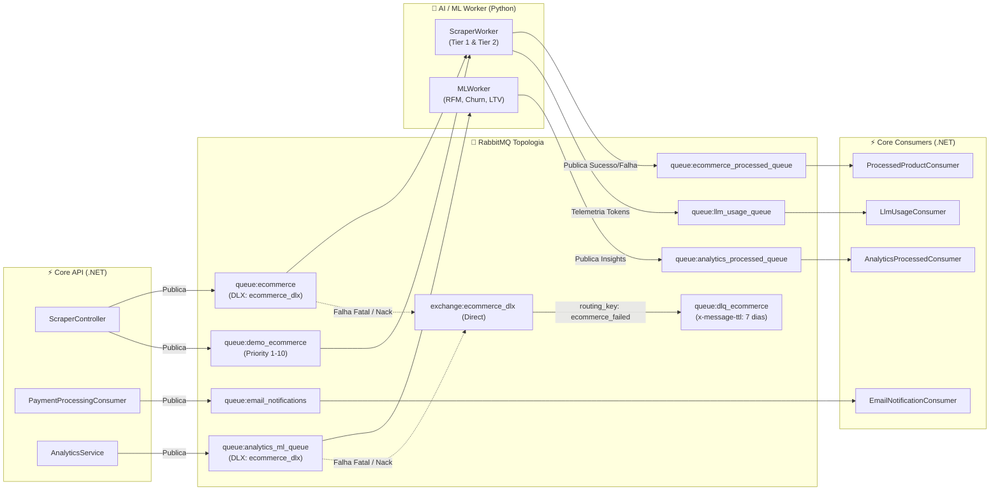
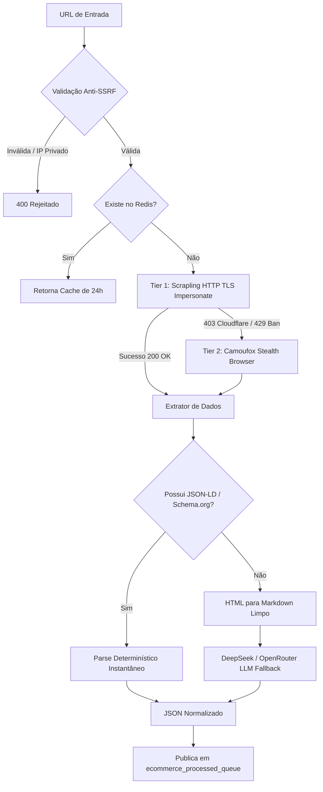

# 🐇 Mensageria, Pipelines de IA e Workers — E-commerce Bot

Este documento detalha a topologia do **RabbitMQ**, os contratos de mensagens JSON, a esteira de extração anti-bloqueio (*Scrapling Engine*) e os modelos preditivos de Machine Learning do ecossistema.

---

## 📡 1. Topologia RabbitMQ & Padrão de Responsabilidade Segregada

O sistema adota o padrão de **Responsabilidade Segregada** para declaração e orquestração de topologia:
- **Core .NET (MassTransit):** Declara e consome todas as filas de regras de negócio, faturamento, integrações externas e auditoria.
- **Worker Python (`aio-pika`):** Declara e consome estritamente as filas de processamento de IA, scraping e ML que ele próprio executa, além de sua Dead Letter Exchange (`ecommerce_dlx`).



---

## 📋 2. Tabela de Filas e Contratos

| Fila | Produtor | Consumidor | DLX / Retries | Finalidade |
|---|---|---|---|---|
| `ecommerce` | Core API | Worker Python | `ecommerce_dlx` / 3 retries | Requisições padrão de extração e enriquecimento de produtos. |
| `demo_ecommerce` | Core API (Demo) | Worker Python | `ecommerce_dlx` (Max Priority 10) | Requisições do Live Demo com priorização alta. |
| `analytics_ml_queue` | Core API | Worker Python | `ecommerce_dlx` | Disparo de jobs analíticos de Machine Learning (RFM/Churn/LTV). |
| `ecommerce_processed_queue` | Worker Python | Core API | MassTransit Error Queue | Retorno do produto com título, copy SEO, tags e imagem. |
| `llm_usage_queue` | Worker Python | Core API | MassTransit Error Queue | Registro de consumo de tokens (prompt + completion) e modelo utilizado. |
| `analytics_processed_queue` | Worker Python | Core API | MassTransit Error Queue | Persistência dos scores de clientes e previsões de churn no banco. |
| `email_notifications` | Core API | Core API | MassTransit Error Queue | Despacho transacional de emails via Resend com templates Razor. |
| `nuvemshop_bulk_sync` | Core API | Core API | MassTransit Error Queue | Sincronização em lote de produtos para a API Nuvemshop. |

---

## 📜 3. Contratos de Mensagens (JSON Schemas)

### 3.1. `ScrapingRequestMessage` (Entrada do Scraper)
```json
{
  "tenantId": "d3b07384-d113-4660-9bb0-a398725b33f5",
  "sku": "PROD-1029",
  "url": "https://loja-concorrente.com/produtos/camiseta-algodao-egipcio",
  "promptCustomizado": "Foque em criar uma copy voltada para o público esportivo premium",
  "isByok": false,
  "userApiKey": null
}
```

### 3.2. `ProductProcessedEvent` (Saída do Scraper)
```json
{
  "tenantId": "d3b07384-d113-4660-9bb0-a398725b33f5",
  "sku": "PROD-1029",
  "status": "COMPLETED",
  "errorMessage": null,
  "aiMetadataJson": "{\"title\":\"Camiseta Algodão Egípcio Ultra Conforto\",\"description\":\"Tecido nobre...\",\"price\":189.90,\"brand\":\"Marca X\",\"category\":\"Moda Masculina\",\"suggested_tags\":[\"algodao-egipcio\",\"premium\",\"moda-masculina\"]}"
}
```

### 3.3. `LlmUsageEvent` (Telemetria de Tokens)
```json
{
  "tenantId": "d3b07384-d113-4660-9bb0-a398725b33f5",
  "model": "deepseek/deepseek-chat",
  "promptTokens": 542,
  "completionTokens": 188,
  "totalTokens": 730,
  "costUsd": 0.000146,
  "isByok": false
}
```

### 3.4. `EmailEventPayload` (E-mails Transacionais)
```json
{
  "tenantId": "d3b07384-d113-4660-9bb0-a398725b33f5",
  "event": "payment.approved",
  "recipientEmail": "cliente@empresa.com.br",
  "recipientName": "Carlos Silva",
  "idempotencyKey": "email:payment:mp_982374619",
  "data": {
    "planName": "Plano Scale Pro",
    "amount": 299.90,
    "paymentMethod": "PIX",
    "resourceId": "mp_982374619"
  }
}
```

---

## 🕵️ 4. Pipeline de Scraping Anti-Bloqueio Multi-Tier

O Worker implementa uma esteira resiliente de extração em cascata:



1. **Tier 1 (Fast HTTP):** Utiliza `curl_cffi` para impersonar o *fingerprint* TLS de navegadores reais (Chrome 120+, JA3/JA4 signatures), garantindo requisições ultrarrápidas (< 500ms).
2. **Tier 2 (Stealth Browser):** Se a página apresentar desafios Cloudflare Turnstile ou bloqueios de renderização JavaScript, o fallback ativa uma instância headless com camuflagem de WebGL, Canvas e áudio.
3. **Extração Híbrida (JSON-LD + LLM):** Primeiro busca metadados estruturados Schema.org (`@type: Product`). Se não houver, converte o DOM em Markdown limpo e extrai via `deepseek/deepseek-chat` com *Structured JSON Output*.

---

## 🧠 5. Pipeline de Machine Learning (RFM, Churn e LTV)

O `MLWorker` processa o histórico transacional do tenant e gera inteligência preditiva:

- **Segmentação RFM (Recência, Frequência, Valor Monetário):** Classifica clientes em clusters (ex: *VIP/Champions*, *Leais*, *Em Risco*, *Hibernando*, *Perdidos*).
- **Preditor de Churn:** Modelo supervisionado de classificação que calcula a probabilidade (0.0 a 1.0) de o cliente não voltar a comprar nos próximos 30/60 dias.
- **Previsão de LTV (Lifetime Value):** Modelo de regressão que estima o valor financeiro total que cada cliente trará nos próximos 12 meses.
