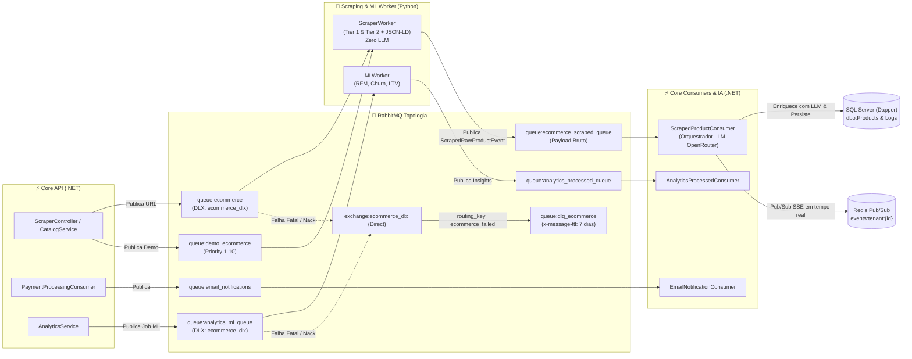
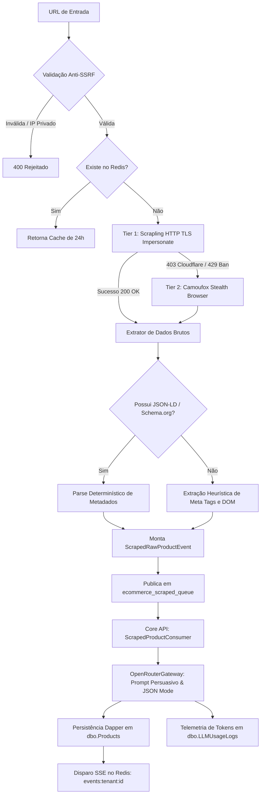

# 🐇 Mensageria, Pipelines de IA e Workers — E-commerce Bot

Este documento detalha a topologia do **RabbitMQ**, os contratos de mensagens JSON, a esteira de extração anti-bloqueio (*Scrapling Engine*) e os modelos preditivos de Machine Learning do ecossistema.

---

## 📡 1. Topologia RabbitMQ & Padrão de Responsabilidade Segregada

O sistema adota o padrão de **Responsabilidade Segregada** para declaração e orquestração de topologia:
- **Core .NET (MassTransit):** Declara e consome todas as filas de regras de negócio, faturamento, integrações externas e auditoria.
- **Worker Python (`aio-pika`):** Declara e consome estritamente as filas de processamento de IA, scraping e ML que ele próprio executa, além de sua Dead Letter Exchange (`ecommerce_dlx`).



---

## 📋 2. Tabela de Filas e Contratos

| Fila | Produtor | Consumidor | DLX / Retries | Finalidade |
|---|---|---|---|---|
| `ecommerce` | Core API | Worker Python | `ecommerce_dlx` / 3 retries | Requisições de extração despachadas para coleta pelo ScraperWorker. |
| `demo_ecommerce` | Core API (Demo) | Worker Python | `ecommerce_dlx` (Max Priority 10) | Requisições de Live Demo com priorização alta. |
| `ecommerce_scraped_queue` | Worker Python | Core API | MassTransit Error Queue | Retorno assíncrono com dados brutos raspados (`ScrapedRawProductEvent`) para orquestração de LLM no Core. |
| `analytics_ml_queue` | Core API | Worker Python | `ecommerce_dlx` | Disparo de jobs analíticos de Machine Learning tabular (RFM/Churn/LTV). |
| `analytics_processed_queue` | Worker Python | Core API | MassTransit Error Queue | Persistência dos scores de clientes e previsões de churn no banco. |
| `email_notifications` | Core API | Core API | MassTransit Error Queue | Despacho transacional de emails via Resend com templates Razor. |
| `nuvemshop_bulk_sync` | Core API | Core API | MassTransit Error Queue | Sincronização em lote de produtos para a API Nuvemshop. |
| `shopify_bulk_sync` | Core API | Core API | MassTransit Error Queue | Sincronização em lote de produtos para a API Shopify. |

---

## 📜 3. Contratos de Mensagens (JSON Schemas)

### 3.1. `ScrapingRequestMessage` (Entrada do Scraper)
```json
{
  "tenantId": "d3b07384-d113-4660-9bb0-a398725b33f5",
  "sku": "PROD-1029",
  "url": "https://loja-concorrente.com/produtos/camiseta-algodao-egipcio",
  "promptContext": "Foque em criar uma copy voltada para o público esportivo premium",
  "isByok": false
}
```

### 3.2. `ScrapedRawProductEvent` (Saída do Scraper Python para o Core C#)
```json
{
  "tenantId": "d3b07384-d113-4660-9bb0-a398725b33f5",
  "sku": "PROD-1029",
  "url": "https://loja-concorrente.com/produtos/camiseta-algodao-egipcio",
  "status": "SCRAPED",
  "titlePreliminary": "Camiseta Algodão Egípcio",
  "descriptionPreliminary": "Tecido macio de alta durabilidade...",
  "price": 189.90,
  "brand": "Marca X",
  "category": "Moda Masculina",
  "images": [
    "https://loja-concorrente.com/images/camiseta-1.jpg"
  ],
  "rawDomText": "Camiseta Algodão Egípcio. Tamanhos P, M, G. Composição 100% algodão.",
  "jsonLdRaw": "{\"@context\":\"https://schema.org\",\"@type\":\"Product\",\"name\":\"Camiseta Algodão Egípcio\"}",
  "errorMessage": null,
  "executionTimeMs": 420
}
```

### 3.3. `ProductEnrichmentMetadata` (Enriquecimento Consolidado pelo C# via OpenRouter)
```json
{
  "title": "Camiseta Algodão Egípcio Ultra Conforto Premium",
  "description": "Desenvolvida com fibras selecionadas de algodão egípcio...",
  "price": 189.90,
  "brand": "Marca X",
  "category": "Moda Masculina",
  "suggestedTags": ["algodao-egipcio", "moda-masculina", "premium"],
  "modelUsed": "deepseek/deepseek-chat"
}
```

### 3.4. `EmailEventPayload` (E-mails Transacionais)
```json
{
  "tenantId": "d3b07384-d113-4660-9bb0-a398725b33f5",
  "event": "payment.approved",
  "recipientEmail": "cliente@empresa.com.br",
  "recipientName": "Carlos Silva",
  "idempotencyKey": "email:payment:mp_982374619",
  "data": {
    "planName": "Plano Scale Pro",
    "amount": 299.90,
    "paymentMethod": "PIX",
    "resourceId": "mp_982374619"
  }
}
```

---

## 🕵️ 4. Pipeline de Scraping Anti-Bloqueio Multi-Tier

O Worker Python implementa uma esteira resiliente de extração em cascata, delegando 100% da orquestração de LLM para o Core C#:



1. **Tier 1 (Fast HTTP):** Utiliza `curl_cffi` para impersonar o *fingerprint* TLS de navegadores reais (Chrome 120+, JA3/JA4 signatures), garantindo requisições ultrarrápidas (< 500ms).
2. **Tier 2 (Stealth Browser):** Se a página apresentar desafios Cloudflare Turnstile ou bloqueios de renderização JavaScript, o fallback ativa uma instância headless com camuflagem de WebGL, Canvas e áudio via Camoufox.
3. **Extração Bruta Pura (Zero LLM no Worker):** Coleta metadados Schema.org (`@type: Product`), microdados e meta tags OpenGraph. O payload bruto raspado é despachado para `ecommerce_scraped_queue`.
4. **Enriquecimento Centralizado no Core API (.NET):** O C# consome o payload bruto, aplica delimitação anti-prompt injection, executa a chamada ao OpenRouter com JSON Schema enforcement, grava o produto via Dapper e dispara a atualização SSE para o usuário.

---

## 🧠 5. Pipeline de Machine Learning (RFM, Churn e LTV)

O `MLWorker` processa o histórico transacional do tenant e gera inteligência preditiva:

- **Segmentação RFM (Recência, Frequência, Valor Monetário):** Classifica clientes em clusters (ex: *VIP/Champions*, *Leais*, *Em Risco*, *Hibernando*, *Perdidos*).
- **Preditor de Churn:** Modelo supervisionado de classificação que calcula a probabilidade (0.0 a 1.0) de o cliente não voltar a comprar nos próximos 30/60 dias.
- **Previsão de LTV (Lifetime Value):** Modelo de regressão que estima o valor financeiro total que cada cliente trará nos próximos 12 meses.

---

## 📧 6. Padrão Arquitetural de Templates de E-mail (Razor C# & Jinja2 Python)

Para manter alta segurança contra injeção de HTML/XSS, tipagem estrita e total separação entre lógica de negócio/mensageria e a camada de apresentação, **é terminantemente proibido inserir HTML inline ou interpolado diretamente em código C# ou Python**.

### 6.1. C# Core API (`EcommerceBot.Core`)
No ecossistema .NET, todo e-mail transacional despachado via fila `email_notifications` segue a arquitetura em 3 elementos:

1. **ViewModel Fortemente Tipada:** Reside estritamente em `EcommerceBot.Core/src/EcommerceBot.Application/ViewModels/Emails/{Nome}EmailViewModel.cs`.
2. **View Razor (.cshtml):** Reside estritamente em `EcommerceBot.Core/src/EcommerceBot.Api/Views/Emails/{Nome}.cshtml` com a diretiva `@model EcommerceBot.Application.ViewModels.Emails.{Nome}EmailViewModel`.
3. **Renderizador Razor:** O consumidor (`EmailNotificationConsumer`) injeta `IRazorTemplateRenderer` e invoca:
   ```csharp
   var model = new PasswordResetEmailViewModel { ... };
   var html = await _templateRenderer.RenderViewToStringAsync("/Views/Emails/PasswordReset.cshtml", model);
   ```

### 6.2. Python Worker (`EcommerceBot.Worker`)
No Worker assíncrono em Python, toda notificação, relatório analítico ou documento HTML formatado gerado pelo serviço deve utilizar Jinja2:

1. **Localização dos Templates:** Arquivos `.html` puros devem residir estritamente na pasta `EcommerceBot.Worker/app/templates/{nome}.html`.
2. **Renderizador Centralizado:** Utilizar a função auxiliar `render_jinja_template` de `app/core/shared/templates.py`:
   ```python
   from app.core.shared.templates import render_jinja_template

   html_content = render_jinja_template("ml_analytics_summary.html", {
       "tenant_id": payload.tenant_id,
       "churn_rate": 0.042,
       "vip_count": 128
   })
   ```
3. **Prevenção de XSS:** O ambiente Jinja2 é instanciado com `autoescape=select_autoescape(["html", "xml", "htm"])`, garantindo que variáveis textuais sejam escapadas automaticamente.

