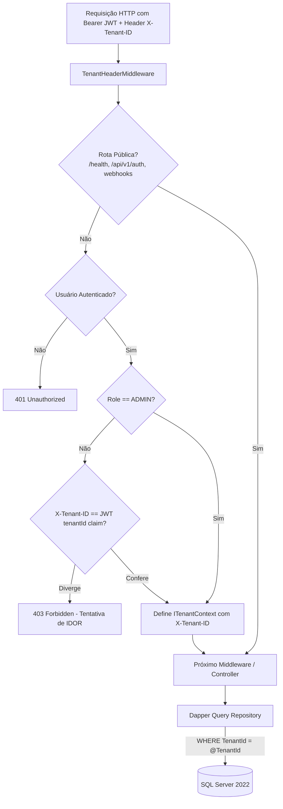

# 🔒 Segurança, Multi-Tenancy e Criptografia BYOK — E-commerce Bot

Este documento estabelece as diretrizes de segurança, o isolamento rigoroso entre tenants (*Multi-Tenancy*), o mecanismo de criptografia para chaves de clientes (*BYOK - Bring Your Own Key*) e as defesas contra vulnerabilidades em produção.

---

## 🏢 1. Isolamento Multi-Tenant Estrito & Prevenção de IDOR

O ecossistema implementa uma barreira dupla de proteção contra vazamento de dados entre empresas (*Cross-Tenant Data Leakage*):



### 1.1. `TenantHeaderMiddleware`
- **Validação de Pertencimento:** Usuários autenticados não-admin só podem consultar dados do tenant ao qual seu token pertence. Se o cabeçalho `X-Tenant-ID` for forjado para o ID de outro tenant, a requisição é abortada imediatamente com `403 Forbidden`.
- **Rotas Isentas:** Endpoints públicos como `/health`, `/openapi`, login/registro (`/api/v1/auth/*`), catálogo público de planos (`GET /api/v1/plans`) e webhooks externos (`/api/v1/webhooks/*`, `/api/v1/emails/webhooks/*`, `/api/v1/shopify/*`, `/api/v1/nuvemshop/*`) não exigem o header `X-Tenant-ID`.

### 1.2. Regra Inviolável de Queries Dapper:
Toda query Dapper que consulte, atualize ou delete registros em tabelas multi-tenant DEVE conter obrigatoriamente a cláusula `WHERE TenantId = @TenantId`.
```csharp
// ✅ CORRETO (Isolado por Tenant)
const string sql = @"
    SELECT Id, Sku, Title, Price, Status 
    FROM dbo.Products 
    WHERE TenantId = @TenantId AND Sku = @Sku;";
return await connection.QueryFirstOrDefaultAsync<Product>(sql, new { TenantId = tenantId, Sku = sku });

// ❌ PROIBIDO (Vulnerável a IDOR)
const string badSql = "SELECT * FROM dbo.Products WHERE Sku = @Sku;";
```

---

## 🔑 2. Criptografia BYOK com AES-256 GCM

Clientes que utilizam chaves de API próprias para LLMs (OpenRouter, OpenAI, DeepSeek, Groq) têm suas credenciais cifradas no banco via **AES-256 GCM** (*Galois/Counter Mode*), garantindo confidencialidade e integridade autenticada.

### 2.1. Estrutura no Banco de Dados (`dbo.TenantAiCredentials`)
- `EncryptedApiKey VARBINARY(MAX)`: Conteúdo cifrado da chave.
- `InitializationVector VARBINARY(32)`: Vetor de inicialização (IV) de 12 bytes gerado aleatoriamente por registro via `RandomNumberGenerator`.
- `AuthTag VARBINARY(32)`: Tag de autenticação de 16 bytes que impede ataques de adulteração de bits (*Ciphertext Tampering*).

```csharp
// Implementação Canônica em AesGcmCryptoService.cs
public (byte[] CipherText, byte[] Nonce, byte[] Tag) Encrypt(string plainText)
{
    var key = Convert.FromBase64String(_securityOptions.MasterKey);
    using var aesGcm = new AesGcm(key, TagSizeInBytes);

    var plainBytes = Encoding.UTF8.GetBytes(plainText);
    var nonce = new byte[NonceSizeInBytes]; // 12 bytes
    var tag = new byte[TagSizeInBytes];     // 16 bytes
    var cipherText = new byte[plainBytes.Length];

    RandomNumberGenerator.Fill(nonce);
    aesGcm.Encrypt(nonce, plainBytes, cipherText, tag);

    return (cipherText, nonce, tag);
}
```

---

## 🛡️ 3. Prevenção de Escalação de Privilégios & Mass Assignment

1. **Auto-registro (`RegisterUserAsync`):** Todo novo usuário registrado via endpoint público recebe estritamente `Role = "MEMBER"`.
2. **Atualização de Perfil (`UpdateProfileAsync`):** O DTO de atualização de perfil do usuário comum não possui o campo `Role`. A elevação de papéis para `ADMIN` exige endpoints administrativos protegidos por `[Authorize(Roles = "ADMIN")]`.

---

## 🌐 4. Blindagem Anti-SSRF no Scraper

Para evitar que usuários enviem URLs maliciosas que permitam o Scraper ler serviços internos ou metadados de nuvem, todas as URLs passam pelo validador [`UrlSecurityValidator`](file:///c:/Users/digob/Desktop/ecommerce-bot/EcommerceBot.Core/src/EcommerceBot.Application/Security/UrlSecurityValidator.cs):

### Regras de Bloqueio:
- Esquemas permitidos: Estritamente `http://` e `https://`.
- **Loopback:** `127.0.0.0/8`, `::1`, `localhost`.
- **IPs Privados RFC 1918:** `10.0.0.0/8`, `172.16.0.0/12`, `192.168.0.0/16`.
- **Link-Local e Metadados de Nuvem:** `169.254.169.254` (AWS/GCP/Azure Instance Metadata), `0.0.0.0`.
- **Resolução DNS Antecipada:** O endereço IP de destino é resolvido antes do envio para checar se aponta para redes privadas.

---

## 🚨 5. Princípio Fail-Closed (Segurança por Padrão)

- **NUNCA use fallbacks estáticos para segredos em produção:**
  - ❌ `var jwtKey = config["Jwt:Key"] ?? "ChavePadrao123";`
  - ✅ `var jwtKey = config["Jwt:Key"] ?? throw new InvalidOperationException("Jwt:Key is mandatory.");`
- Se qualquer variável de ambiente essencial (`JWT_SECRET_KEY`, `AES_MASTER_KEY`, `DB_CONNECTION_STRING`, `REDIS_URL`, `RABBITMQ_URL`) estiver ausente ou inválida, a aplicação **recusa a inicialização (Crash on Startup)** para evitar operar em modo vulnerável.
