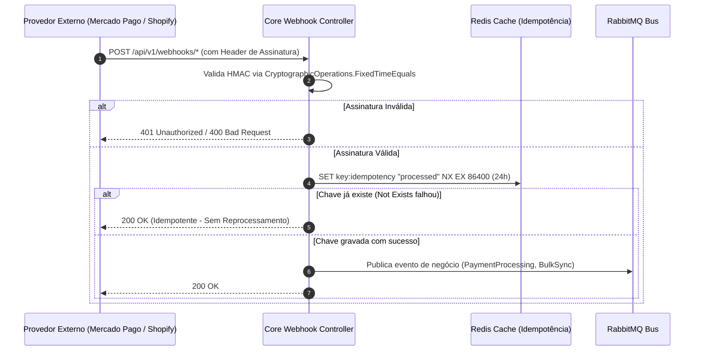

# 🔌 Webhooks, Integrações de E-commerce e Notificações — E-commerce Bot

Este documento fornece o guia completo de integração para Webhooks de pagamento e e-commerce, validação criptográfica de assinaturas, idempotência com Redis, motor de templates de e-mail Razor (`.cshtml`) e alertas no Discord.

---

## 🛡️ 1. Blindagem Criptográfica de Webhooks & Idempotência

Todos os webhooks expostos pela API passam por duas etapas obrigatórias de segurança:
1. **Validação de Assinatura em Tempo Constante:** Previne *Timing Attacks* utilizando `CryptographicOperations.FixedTimeEquals`.
2. **Idempotência no Redis:** Garante que reenvios automáticos de plataformas externas não causem cobranças duplicadas ou execuções repetidas.



---

## 🔑 2. Guia de Configuração de Webhooks por Provedor

### 2.1. Mercado Pago (`MercadoPagoWebhookController.cs`)
- **Endpoint:** `POST /api/v1/webhooks/mercadopago`
- **Cabeçalho:** `x-signature` (contém `ts` e `v1`)
- **Validação:** Extrai o timestamp `ts` e o hash `v1`. Concatena `id:[data.id];request-id:[x-request-id];ts:[ts];` e calcula o HMAC SHA256 com a chave de webhook configurada.
- **Idempotência:** Chave `idempotency:mercadopago:{data.id}` com TTL de 24 horas.

### 2.2. Resend Emails (`EmailWebhookController.cs`)
- **Endpoint:** `POST /api/v1/emails/webhooks/resend`
- **Cabeçalhos:** `svix-id`, `svix-timestamp`, `svix-signature`
- **Validação:** Algoritmo Svix HMAC SHA256 com secret `whsec_...`.
- **Eventos Processados:** `email.delivered`, `email.bounced`, `email.complained`. Atualiza a tabela `dbo.EmailLogs`.

### 2.3. Shopify (`ShopifyIntegrationController.cs`)
- **Endpoint:** `POST /api/v1/shopify/webhooks/products`
- **Cabeçalho:** `x-shopify-hmac-sha256` (Base64)
- **Validação:** Calcula o HMAC SHA256 do payload bruto com `Shopify:WebhookSecret` e compara em Base64.
- **Idempotência:** Chave `idempotency:shopify:webhook:{webhook_id}`.

### 2.4. Nuvemshop (`NuvemshopIntegrationController.cs`)
- **Endpoint:** `POST /api/v1/nuvemshop/webhooks/orders`
- **Cabeçalho:** `x-linkedstore-hmac-sha256`
- **Validação:** Calcula o HMAC SHA256 do corpo da requisição com `Nuvemshop:ClientSecret`.

---

## 📧 3. Motor de E-mails Transacionais com Razor (.cshtml)

O envio de e-mails utiliza templates compilados dinamicamente via **Razor View Engine** com ViewModels fortemente tipadas:

```
EcommerceBot.Core/src/
├── EcommerceBot.Application/ViewModels/Emails/
│   ├── WelcomeEmailViewModel.cs         # Boas-vindas ao usuário
│   ├── PaymentApprovedEmailViewModel.cs # Recibo de confirmação de pagamento
│   ├── LowBalanceEmailViewModel.cs      # Alerta de créditos de IA quase esgotados
│   ├── ScrapingCompletedEmailViewModel.cs # Conclusão de lote de scraping
│   └── SyncFailedEmailViewModel.cs      # Alerta de falha de conexão de loja
└── EcommerceBot.Api/Views/Emails/
    ├── Welcome.cshtml
    ├── PaymentApproved.cshtml
    ├── LowBalance.cshtml
    ├── ScrapingCompleted.cshtml
    └── SyncFailed.cshtml
```

### Como Disparar um E-mail Transacional:
Basta publicar uma mensagem `EmailEventPayload` no barramento:
```csharp
await _publishEndpoint.Publish(new EmailEventPayload
{
    TenantId = tenantId,
    Event = "payment.approved",
    RecipientEmail = "cliente@loja.com",
    RecipientName = "Maria Silva",
    IdempotencyKey = $"email:payment:{orderId}",
    Data = new Dictionary<string, object>
    {
        { "planName", "Plano Growth" },
        { "amount", 199.90 },
        { "paymentMethod", "Cartão de Crédito" },
        { "resourceId", orderId }
    }
});
```

---

## 🚨 4. Alertas Críticos no Discord com Rich Embeds

O serviço [`IDiscordAlertService`](file:///c:/Users/digob/Desktop/ecommerce-bot/EcommerceBot.Core/src/EcommerceBot.Application/Interfaces/IDiscordAlertService.cs) envia notificações estruturadas e coloridas para o canal de DevOps/Monitoramento:

| Nível de Alerta | Cor Embed | Gatilhos Principais |
|---|---|---|
| 🔴 **Critical (`0xEF4444`)** | Vermelho | Erros 500 não tratados (Middleware Global), mensagens enviadas para DLQ, falha fatal em scripts de backup R2. |
| 🟡 **Warning (`0xF59E0B`)** | Amarelo | Saldo de créditos de IA de tenant zerado, retries sucessivos em APIs de e-commerce. |
| 🟢 **Info (`0x10B981`)** | Verde | Deploy finalizado com sucesso, snapshot de backup diário concluído no Cloudflare R2. |

### Exemplo de Disparo no C#:
```csharp
await _discordAlertService.SendCriticalAlertAsync(
    title: "Falha de Conexão com Gateway Mercado Pago",
    description: "Timeout persistente após 3 tentativas de consulta ao resource mp_12345.",
    exception: ex,
    source: "PaymentProcessingConsumer"
);
```

### Exemplo de Disparo no Python Worker:
```python
from app.core.shared.discord import discord_alerter

await discord_alerter.send_critical_alert(
    title="Worker Scraper Crash",
    description="Falha irrecuperável ao inicializar instância headless do Camoufox.",
    error=err,
    source="ScraperWorker Tier 2"
)
```
